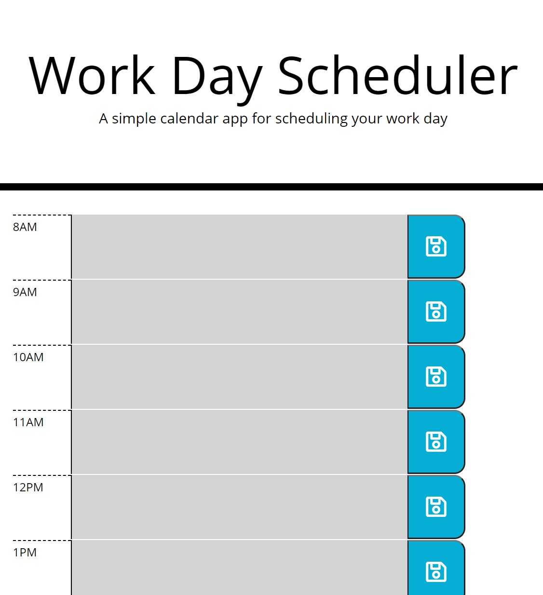

# Homework 05 - Work Day Scheduler

This is a simple calendar that lets someone save events for each hour of the work day. The app uses HTML, CSS, jQuery, and moment.js.

## Functionality

Enter a task in time-blocks, each of which represent an hour of the workday (8 am through 6 pm). To help the user avoid accidentally entering text in the wrong timeblock, times in the past are colored grey, the current time is red, and future times are green. 

Once entered, click the save button that corresponds with the entry. To edit, simply change the text and re-save. The entries will remain after closing and reopening the browser.

## Screenshots

